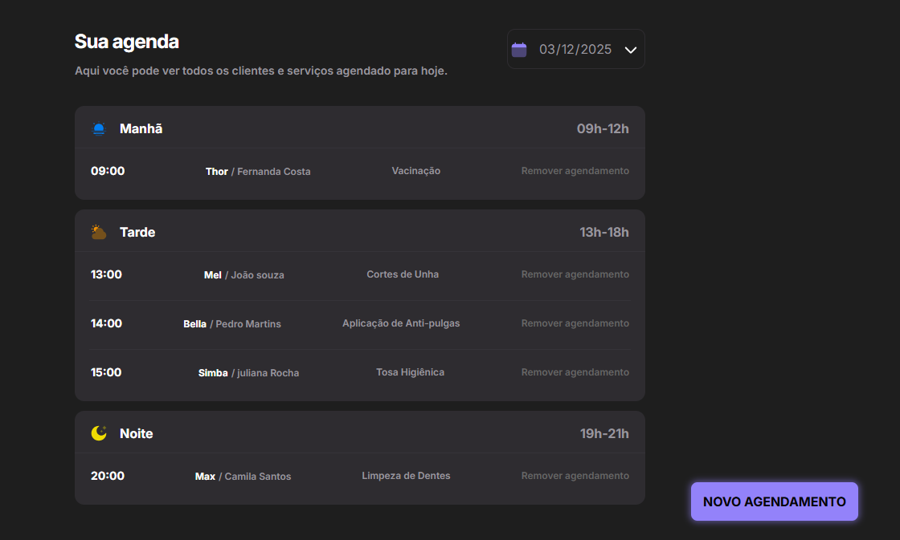

<h1 align="center"> PetShop - Agendamento de Serviços </h1>

<p align="center">
  Um sistema de dashboard para gerenciamento de agendamentos de banho, tosa e serviços veterinários.
</p>

<p align="center">
  <a href="#-tecnologias">Tecnologias</a>&nbsp;&nbsp;&nbsp;|&nbsp;&nbsp;&nbsp;
  <a href="#-projeto">Projeto</a>&nbsp;&nbsp;&nbsp;|&nbsp;&nbsp;&nbsp;
  <a href="#-como-rodar">Como Rodar</a>&nbsp;&nbsp;&nbsp;|&nbsp;&nbsp;&nbsp;
  <a href="#memo-licença">Licença</a>
</p>

<p align="center">
  
</p>

<br>

<p align="center">
  
</p>

## 🚀 Tecnologias

Esse projeto foi desenvolvido com uma stack moderna de JavaScript e ferramentas de automação:

- **JavaScript (ES Modules)**
- **Webpack & Babel** (Build e compatibilidade)
- **Day.js** (Manipulação robusta de datas e horas)
- **JSON Server** (Mock de API RESTful)
- **CSS3** (Estilização modular)

## 💻 Projeto

O **PetShop Manager** é uma aplicação web para organizar a rotina de atendimentos de um Pet Shop. O sistema permite cadastrar o tutor, o pet, o serviço desejado e agendar um horário específico.

Destaques Funcionais:
- **Agendamento Inteligente:** O sistema verifica a disponibilidade de horários e organiza os cards automaticamente nos períodos do dia (Manhã, Tarde e Noite).
- **CRUD Completo:** É possível criar novos agendamentos, visualizar a lista do dia e cancelar atendimentos (com persistência de dados no banco simulado).
- **Dados Detalhados:** O formulário captura informações essenciais como nome do tutor, nome do pet, telefone de contato e descrição do serviço.
- **Feedback Visual:** Uso de modais e alertas para confirmar ações e manter o usuário informado.

## 🎲 Como Rodar

Este projeto utiliza uma arquitetura separada (Front-end e API Mock). Você precisará de dois terminais.

```bash
# 1. Clone o repositório
$ git clone [https://github.com/miqueiassantoss/petshop.git](https://github.com/miqueiassantoss/petshop.git)

# 2. Entre na pasta do projeto
$ cd petshop

# 3. Instale as dependências
$ npm install

# 4. Iniciar a API (Back-end)
$ npm run server
# O servidor iniciará na porta 3333

# 4. Iniciar o Front-end
$ npm run dev
# A aplicação abrirá automaticamente no seu navegador

```

## 📝 Licença

Esse projeto está sob a licença MIT.

---

<p align="center">
  Feito por <a href="https://github.com/miqueiassantoss">Miqueias Santos</a>
</p>